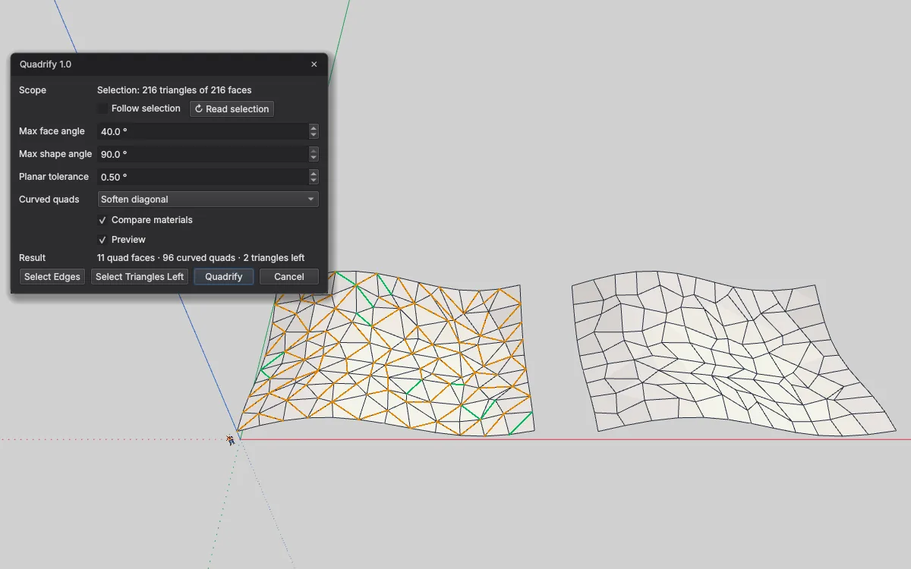

# Quadrify — triangles to quads for IngeTrazo

Turns triangulated meshes (OBJ, STL, DAE, glTF, terrain) into **four-sided faces**, and rebuilds terrain as a clean **grid of quads**.

[Deutsch → LIESMICH.md](LIESMICH.md)

## Installation
1. In IngeTrazo: **Extensions ▸ Open plugins folder** (Windows: `%APPDATA%\ingetrazo\plugins\`, Linux: `~/.local/share/ingetrazo/plugins/`).
2. Copy `quadrify_tool.py` into that folder.
3. Restart IngeTrazo → **Extensions ▸ Quadrify ▸** *Quadrify… · Grid Remesh…* (also on the right-click menu when faces are selected).

Requires IngeTrazo ≥ 0.5 (extension API 2).

## Quadrify…
Removes the diagonal between two triangles wherever they make a good quad. Works on the selected faces, or on the whole mesh being edited when nothing is selected (open a group first to work inside it).

- **Flat pairs** become one real quad face; paint and tags go with it.
- **Curved pairs** (sphere, terrain) cannot be one face in IngeTrazo — faces are planar — so the diagonal is **softened** (or hidden) and the pair reads as a quad. *Keep triangles* leaves them alone.
- **Max face angle** — how much two triangles may fold against each other. **Max shape angle** — how far each corner may stray from 90° (raise it up to 90° for irregular meshes such as terrain). **Planar tolerance** — up to this fold a pair becomes one real face. **Compare materials** — only pair triangles with the same paint.
- The pairing finds the largest possible number of quads; **Select Triangles Left** shows what remains, **Select Edges** the diagonals that would go.
- Preview: green = becomes a quad face, orange = softened diagonal.

## Grid Remesh…
Rebuilds a height field (terrain) as a regular grid: quads everywhere inside, border cells cut to the outline (*Clip to outline*) or left out (*Whole cells only*). Heights are sampled from the old surface. **Spacing**, **Grid angle** (*Auto* turns the grid along the site), **Planar tolerance**, Preview.

Both commands are one undo step; the dialogs do not block the viewport (orbit, pan, zoom).

## Changelog
- **1.1** — own toolbar **Quadrify** with one icon per command (Quadrify… · Grid Remesh…). It starts on a row of its own under the built-in toolbars; move, float or hide it like those (right-click on a toolbar). Icons drawn in IngeTrazo's own style, they follow the light/dark theme.
- **1.0** — first release.

## Licence
GPL-3.0-or-later · © 2026 Pesi (pesi3d.de) · [Impressum](https://pesi3d.de)

3ds Max is a trademark of Autodesk, Inc.; it is named only to describe the function («Quadrify All / Quadrify Selection»). This plugin is not affiliated with or endorsed by Autodesk.
